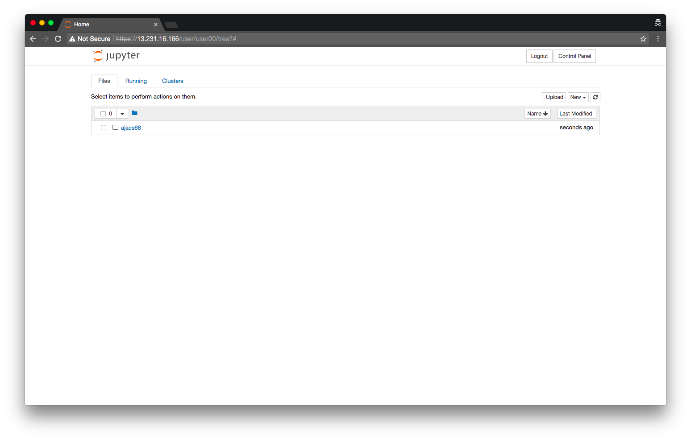
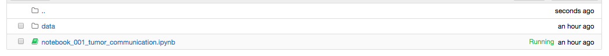
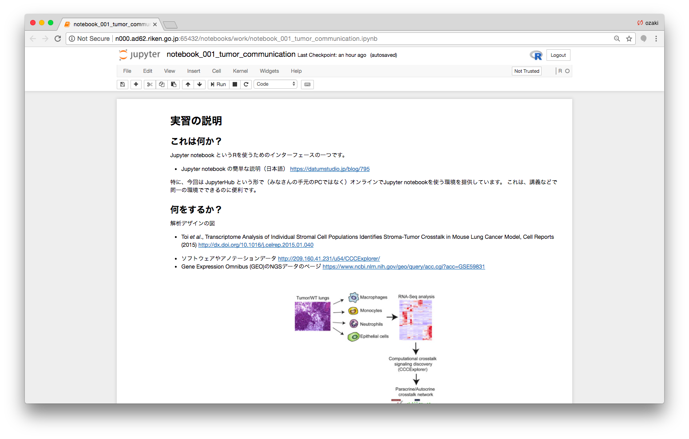

# 実習の説明

AJACS68 (AJACS浜松) [https://events.biosciencedbc.jp/training/ajacs68](https://events.biosciencedbc.jp/training/ajacs68)  
January 17, 2018

尾崎 遼  
Haruka Ozaki  
haruka.ozaki@riken.jp | http://yuifu.github.io | [@yuifu](https://twitter.com/yuifu)

理化学研究所 情報基盤センター バイオインフォマティクス研究開発ユニット 基礎科学特別研究員  
Bioinformatics Research Unit, ACCC, RIKEN

----

## 概要

この文章では実習について説明します。[実習用環境の準備](tutorial_00_prepare_environment.md)が終わっていることを前提とします。

実習用資料: https://github.com/yuifu/ajacs68

----

----

## 実習用環境の簡単な説明

Jupyter notebook はRを使うインターフェースの一つです。JupyterHubはたくさんのユーザに統一的なJupyter notebookの実行環境を提供するサーバーです。

## Jupyter notebook を開く

`Chrome`でJupyter notebook のホーム画面を開いた状態にしてください。

`ajacs68` のディレクトリ内に移動します。`ajacs68`をクリックしてください。

下図のようなファイル一覧が表示されます。

`notebook_001_tumor_communication.ipynb`をクリックします。下図のようなタブが表示されれば成功です。

----
