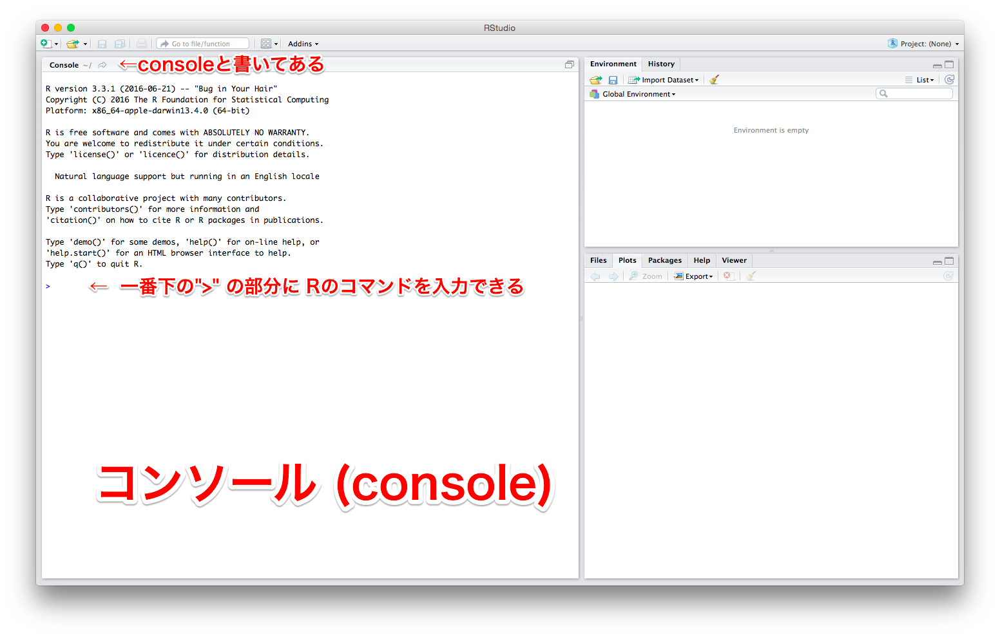
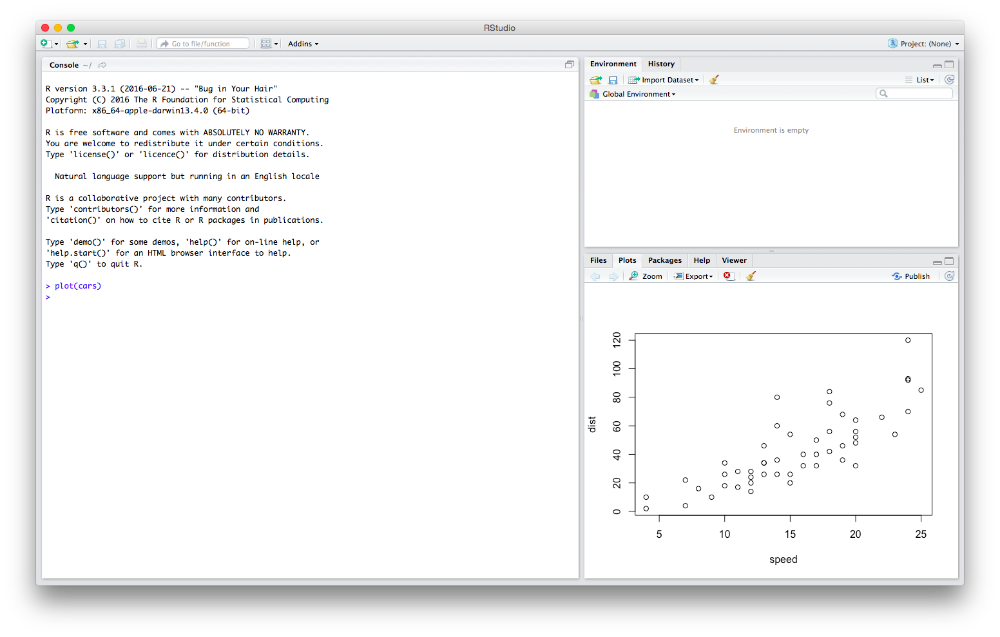
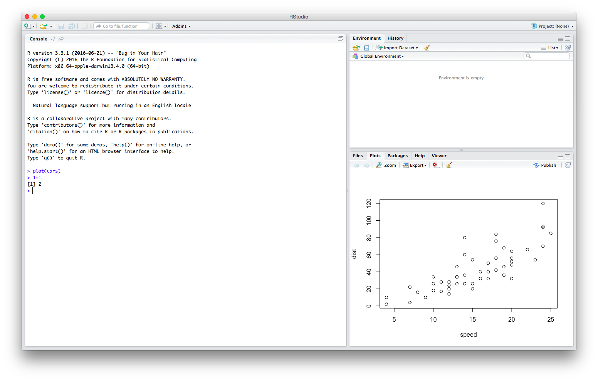

# RStudioでのRのパッケージのインストール

AJACS68 (AJACS浜松) [https://events.biosciencedbc.jp/training/ajacs68](https://events.biosciencedbc.jp/training/ajacs68)  
January 17, 2018

尾崎 遼  
Haruka Ozaki  
haruka.ozaki@riken.jp | http://yuifu.github.io | [@yuifu](https://twitter.com/yuifu)

理化学研究所 情報基盤センター バイオインフォマティクス研究開発ユニット 基礎科学特別研究員  
Bioinformatics Research Unit, ACCC, RIKEN


----

## 概要

この文章ではRStudioでRのパッケージをインストールする方法を解説します。特にCRANとBioconductorからのインストールについて説明します。

Rに全く触ったことがない人も対象にしているため、やや冗長な書き方になる部分もありますがご了承ください。

## 内容

- RとRStudioのインストール
- RStudioでのRのコマンドの実行
- レポジトリからのパッケージのインストール
  - CRANのパッケージのインストール
  - Bioconductorのパッケージのインストール

---


## RとRStudioのインストール

まず、RとRStudioのインストールを完了しましょう。

### Rのインストール

1. アクセス https://cran.r-project.org/
2. 「Download and Install R」から自分のOSのRをダウンロード（最新版はR 3.4.3）
3. ダウンロードしたものをインストールして展開（基本的に初期設定でかまいません）

Windowsユーザーの方はこちらの日本語記事も参考になります: https://qiita.com/FukuharaYohei/items/8e0ddd0af11132031355

### RStudioのインストール

1. アクセス https://www.rstudio.com/products/rstudio/download/
2. Desktop Open Source License (FREE) の「download」をクリック
3. 「Installers for Supported Platforms」（一覧表）に飛ぶのでそこから自分のOSのものを選んでダウンロード
4. ダウンロードしたものをインストールして展開（基本的に初期設定でかまいません）

RStudio の基本的な使い方はこちらが参考になります: 統合TV 「2017-05-12 RStudioでRを直感的に使おう MacOS版 2017」　http://togotv.dbcls.jp/20170512.html
　　　　　　　　　　


----

## RStudioでのRのコマンドの実行

RStudio を起動すると以下の様にいくつかの区画に仕切られたウィンドウが表示されます。この中で「コンソール (console)」という部分があります。




コンソールでRのコマンドを入力し、実行すると、出力結果が表示されます。`>` の右側にRのコマンドを入力することができます。

試しに以下のコマンドを入力し、実行してみましょう。実行するには、Enter (もしくはReturn) キーを押します。

```
plot(cars)
```

すると、右下の区画に散布図のプロットが表示されます。



次に、以下のコマンドを入力し、実行してみましょう。

```
1+1
```

すると、以下の様な出力結果が表示されると思います。

```
> 1+1
[1] 2
```



これで、RStudioでRのコマンドを実行できる様になりました。


## レポジトリからのパッケージのインストール

パッケージとはRの機能を拡張する便利なコマンド群です。パッケージをインストールすることで、Rで様々なことができるようになります。

パッケージを配布するために集積する場所をレポジトリと呼びます。

以下では、CRANとBioconductorという２つのレポジトリからのパッケージのインストール方法を説明します。なお、**パッケージのインストールは時間がかかる場合も多いので、時間に余裕がある時に行うこと**をおすすめします。


### CRANのパッケージのインストール
RのパッケージのレポジトリにCRANがあります。

以下のコマンドを実行すると、CRANから `tidyverse` というパッケージがインストールされます。

```
install.packages("tidyverse")
```

以下のコマンドを実行すると、CRANから `magrittr` というパッケージがインストールされます。

```
install.packages("magrittr")
```

### Bioconductorのパッケージのインストール

[Bioconductor](https://bioconductor.org/) は生命科学系のデータ解析用のパッケージのレポジトリです。

以下のコマンドを実行すると、Bioconductorの基本パッケージがインストールされます。


```
source("https://bioconductor.org/biocLite.R")
biocLite()
```


----
